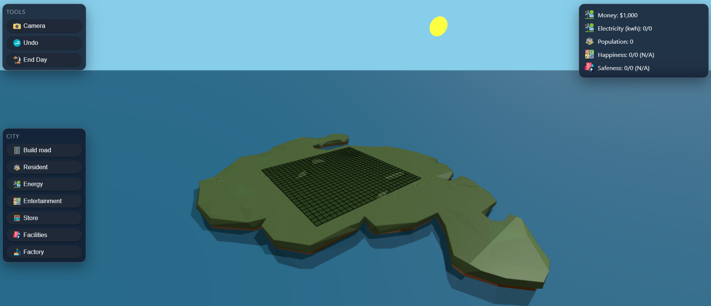

## 3D City Builder Game
DEMO:https://threed-city-game-1bdv.onrender.com/

A **browser-based 3D city-building game** developed using **Three.js** for real-time graphics rendering.  
The project focuses on modeling urban buildings, implementing a flexible camera system, and handling interaction logic between the player, city structures, and development indicators.

Inspired by the mobile game **SimCity**, this project allows players to **build and manage their own city** through an intuitive and interactive interface.

### Key Features

- **Real-time 3D Rendering** using Three.js
- **City Building System** with multiple types of structures
- **Interactive Camera Controls** for exploring the city
- **Player–Building Interaction** for constructing and managing infrastructure
- **City Development Metrics** to simulate urban growth and management

### Technologies Used

- **Three.js** – 3D rendering engine for the browser  
- **JavaScript** – core game logic and graphics processing  
- **HTML / CSS** – interface and layout  

### Inspiration

This project is inspired by **SimCity**, aiming to recreate a simplified **city management simulation** where players can design, expand, and monitor the development of their city in a 3D environment.
